# ArogyaGrid — System Architecture & Technical Design Document (system_design.md)
**Document Version:** 1.0.0  
**Target Platform:** India's Primary Health Centre (PHC) & Community Health Centre (CHC) Network  
**Compliance Standards:** Digital Personal Data Protection (DPDP) Act 2023, Ayushman Bharat Digital Mission (ABDM) Guidelines  
**Architecture Paradigm:** Resilient Offline-First, Tri-Resource Telemetry, Federated AI & Model Context Protocol (MCP)

---

## 1. Executive Summary & Problem Statement

### 1.1 Context & Background
India's public rural healthcare grid operates across **150,000+ Primary Health Centres (PHCs)**, Community Health Centres (CHCs), and Sub-Centres serving over 900 million citizens. Frontline healthcare facilities face acute systemic challenges:
1. **Intermittent Grid Power & Connectivity Outages**: Severe network dropouts prevent real-time telemetry updates.
2. **Resource Stockouts & Supply Chain Latency**: Critical drug stockouts (e.g., Anti-Rabies Vaccine, ORS, Insulin) frequently occur while adjacent districts possess surplus inventory due to lack of cross-district visibility.
3. **Tri-Resource Asymmetry**: Healthcare delivery requires coordinated alignment of **medicines**, **bed capacity** (general, oxygen, ICU, pediatric), and **staff attendance** (doctors, specialists, nurses). Isolated tracking of just medicine inventory fails during clinical surges.
4. **Data Privacy & Interstate Boundaries (DPDP Act 2023)**: Centralizing granular citizen health records or raw transaction logs across state jurisdictions creates compliance risks and privacy vulnerabilities.

### 1.2 The ArogyaGrid Solution
ArogyaGrid is a production-grade, offline-capable, resilient, and federated healthcare supply chain and hospital resource orchestration platform designed specifically for India's healthcare infrastructure.

```
┌──────────────────────────────────────────────────────────────────────────────────┐
│                                 AROGYAGRID CORE                                  │
│                                                                                  │
│   [ Offline-First PWA ]       [ Tri-Resource Hub ]       [ Federated AI (DP) ]   │
│   IndexedDB + Local Queue     Meds + Beds + Staff        FedAvg + Laplace Noise  │
│                                                                                  │
│   [ Idempotent Ingestion ]    [ Inter-District Escrow ]  [ Agentic MCP Server ]  │
│   UUID-keyed Deduplication    Haversine Optimization     Typed Health Ops Tools  │
└──────────────────────────────────────────────────────────────────────────────────┘
```

### 1.3 Core Architectural Invariants
The system enforces five mandatory non-negotiable architectural invariants:

1. **Transaction Idempotency**:
   - Every stock intake, dispense, bed allocation, or staff update contains a cryptographically unique `transaction_uuid`.
   - Repeated sync transmissions are acknowledged with HTTP 200 without double-counting inventory or transactions.
2. **Tri-Resource Scope**:
   - Tracks **Medicines & Vaccines** (quantity, daily burn rate, batch expiry).
   - Tracks **Dynamic Bed Matrix** (`GENERAL`, `OXYGEN`, `ICU`, `PEDIATRIC`).
   - Tracks **Staff Attendance Roster** (Doctors, Specialists, Nurses, Pharmacists on duty).
3. **Federated AI Privacy (DPDP Act 2023 Compliant)**:
   - Zero raw patient records or hospital logs are transmitted across state lines.
   - Node clusters in Bihar, Jharkhand, Odisha, West Bengal, and Assam compute local gradient updates; the central coordinator aggregates model weights via Federated Averaging (`FedAvg`) with Laplace Differential Privacy noise ($\epsilon = 1.0$).
4. **Resilient Offline-First Sync**:
   - Frontline touch kiosks operate fully offline during grid power cuts or internet outages.
   - PWA caches transactions in client-side IndexedDB and replays them via `/api/v1/telemetry/intake` upon network reconnection.
5. **Role-Based Access Control (RBAC)**:
   - Four discrete security roles: `ADMIN`, `DISTRICT_OFFICER`, `DOCTOR`, and `PHC_STAFF`.

---

## 2. High-Level System Architecture

ArogyaGrid follows a decoupled micro-service and orchestrator topology comprising five primary architectural tiers:
1. **Client Tier**: React 18 PWA with Vite, Tailwind CSS, Lucide icons, Leaflet GIS, and IndexedDB local store.
2. **API & Orchestration Tier**: Node.js Express REST Gateway & Socket.io Real-Time Event Hub.
3. **Machine Learning & Privacy Tier**: Python FastAPI microservice providing RandomForest stockout forecasting, cross-district rebalancing heuristics, and Federated Averaging (FedAvg).
4. **Agentic Tool Tier**: Model Context Protocol (MCP) JSON-RPC Stdio server exposing typed operations for AI agents.
5. **Persistence Tier**: Dual-layer store comprising PostgreSQL 16 relational database with an automatic zero-downtime In-Memory Datastore fallback.

### 2.1 System Topology Diagram

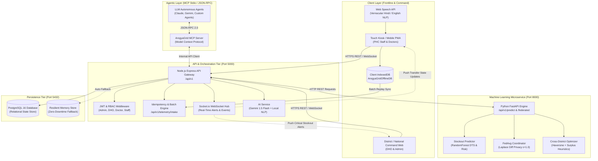

---

## 3. Subsystem Deconstruction

### 3.1 Frontend Architecture (React 18 + Vite PWA)

The frontend is constructed using React 18, Tailwind CSS, Lucide React, and HTML5 Web APIs. It operates both as an administrative web console and as a ruggedized touch kiosk for rural health workers.

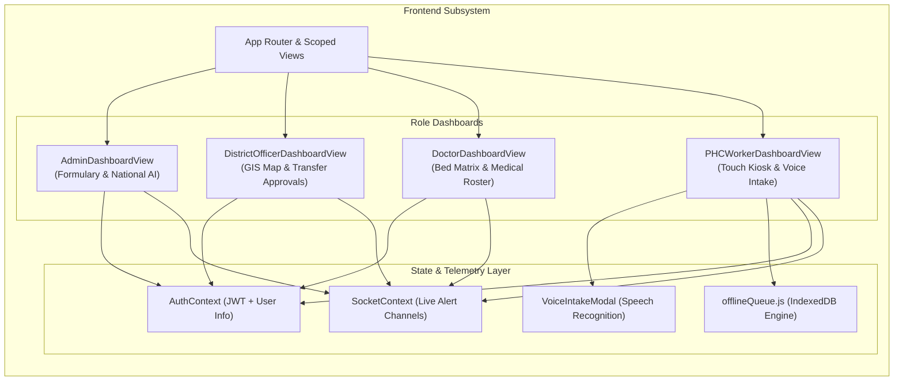

#### Key Frontend Modules:
- **`offlineQueue.js`**: Interacts with IndexedDB database `ArogyaGridOfflineDB` under object store `pending_telemetry`. When an HTTP request fails or network status is offline (`navigator.onLine === false`), transactions are assigned a `transaction_uuid` and stored locally. A background sweep replays pending records once connectivity is re-established.
- **`VoiceIntakeModal.jsx`**: Uses the browser's `SpeechRecognition` API (supporting `hi-IN` and `en-IN`), captures raw speech, presents immediate transcript previews, and transmits audio text to the backend NLP engine for entity extraction.
- **`MapView.jsx`**: Renders district-level Leaflet GIS maps, color-coding PHCs into `HEALTHY` (emerald), `WARNING` (amber), and `CRITICAL` (rose) markers with real-time popup telemetry.
- **`BedMatrix.jsx`**: Clinical bed management module for admitting and discharging patients across `GENERAL`, `OXYGEN`, `ICU`, and `PEDIATRIC` categories.
- **`FederatedCenter.jsx` & `FederatedExplainerModal.jsx`**: Interactive visualization of state node weight distributions, loss curves, and differential privacy noise parameters.

---

### 3.2 Backend Orchestrator (Node.js & Express REST/WS)

The backend provides the API gateway, JWT authentication, RBAC enforcement, transactional deduplication, and WebSocket broadcast orchestration.

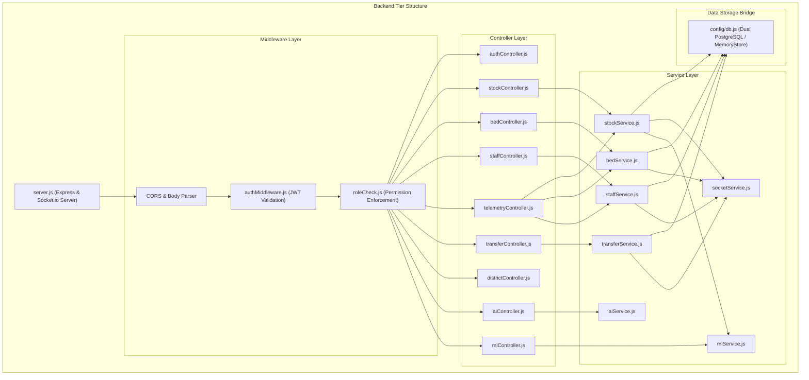

#### Idempotency Ingestion Algorithm:
When `/api/v1/telemetry/intake` receives a batch payload:
1. Validates array structure of payload items.
2. For each transaction, checks if `transaction_uuid` already exists in `stock_transactions`.
3. If found: marks receipt as `{ transaction_uuid, status: 'ALREADY_PROCESSED', duplicate: true }`.
4. If not found: updates current inventory, writes transaction audit record, dispatches `stock:updated` WebSocket event, triggers predictive stockout inference, and flags receipt as `{ transaction_uuid, status: 'SUCCESS', duplicate: false }`.
5. Returns HTTP 200 with batch receipts array, ensuring zero data loss and zero double-counting.

---

### 3.3 Machine Learning Microservice (Python FastAPI)

The ML service is a specialized microservice running on Python 3.11 with FastAPI, NumPy, and Scikit-Learn. It hosts three discrete computational engines:

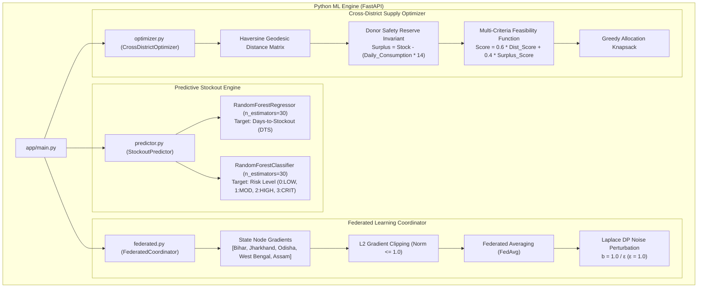

#### Mathematical Formulations:

##### 1. Predictive Days-to-Stockout (DTS):
$$\text{Effective Consumption} = \text{Daily Consumption} \times \text{Footfall Surge Factor} \times (1.0 + 0.3 \times \text{Weather Risk})$$
$$\text{DTS} = \frac{\text{Current Stock}}{\text{Effective Consumption}}$$
$$\text{Recommended Restock} = \max(0, (\text{Effective Daily Rate} \times 30) - \text{Current Stock})$$

##### 2. Differential Privacy Perturbation in FedAvg:
For global parameter vector $\mathbf{w}_t \in \mathbb{R}^d$ aggregated over $K$ participating state nodes:
$$\mathbf{w}_{t+1} = \frac{1}{K}\sum_{k=1}^K \text{clip}\left(\mathbf{w}_{t, k}, C\right) + \text{Laplace}\left(0, \frac{\Delta S}{\epsilon}\right)$$
Where $C = 1.0$ (clipping threshold), $\Delta S = \frac{C}{K}$ (sensitivity), and $\epsilon = 1.0$ (privacy budget).

##### 3. Cross-District Supply Feasibility:
$$\text{Haversine Distance: } d = 2 R \arcsin\left(\sqrt{\sin^2\left(\frac{\Delta \phi}{2}\right) + \cos\phi_1\cos\phi_2\sin^2\left(\frac{\Delta \lambda}{2}\right)}\right)$$
$$\text{Distance Score} = \max\left(0.1, 1.0 - \frac{d}{R_{\max}}\right)$$
$$\text{Surplus Score} = \min\left(1.0, \frac{\text{Stock}_{\text{donor}} - 14 \times \text{Consumption}_{\text{donor}}}{\text{Stock}_{\text{requested}}}\right)$$
$$\text{Feasibility Score} = 0.6 \cdot \text{Distance Score} + 0.4 \cdot \text{Surplus Score}$$

---

### 3.4 Model Context Protocol (MCP) Server

The MCP Server implements the JSON-RPC 2.0 Stdio specification, allowing LLM autonomous agents (Claude, Gemini, Open-Source models) to inspect live state and trigger health interventions programmatically.

```mermaid
graph LR
    subgraph "MCP Agentic Interface"
        Agent["External LLM Agent"]
        MCPProcess["mcp_server/index.js (Stdio JSON-RPC)"]
        
        subgraph "Exposed Typed Tools"
            T1["get_phc_inventory_status<br/>Input: phc_id"]
            T2["simulate_stockout_risk<br/>Input: phc_id, medicine_id, surge"]
            T3["propose_resource_transfer<br/>Input: target_phc_id, medicine_id, needed_qty"]
            T4["trigger_federated_round<br/>Input: participating_nodes[]"]
        end

        Agent <-->|JSON-RPC 2.0 (stdio)| MCPProcess
        MCPProcess --> T1 & T2 & T3 & T4
        T1 & T2 & T3 & T4 -->|HTTP REST Client| Backend["Backend API Gateway (:5000)"]
    end
```

---

### 3.5 Vernacular Hindi / English Natural Language Parser

Rural frontline workers speak naturally into kiosks. ArogyaGrid provides a hybrid dual-engine parser:
1. **Primary Cloud Engine**: Gemini 1.5 Flash via REST API converting freeform Hindi speech to structured JSON payloads.
2. **Local Zero-Dependency Heuristic Engine**: Embedded regex, phonetic keyword tokenizer, and fuzzy matcher that functions without internet connectivity.

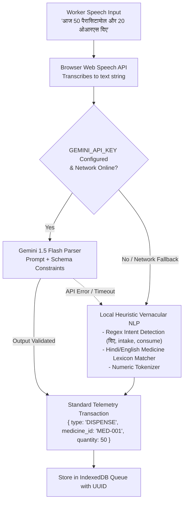

---

## 4. Database Architecture & Data Models

ArogyaGrid uses PostgreSQL 16 as its primary relational engine, supplemented with an in-memory replica store for fault tolerance.

### 4.1 Entity-Relationship (ER) Diagram

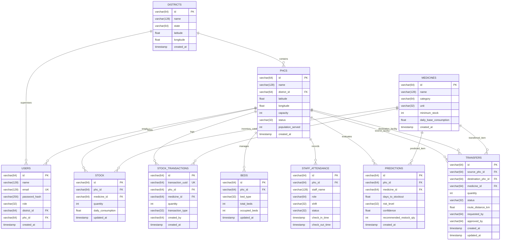

### 4.2 Database Constraints & Integrity Guarantees
- `stock_transactions.transaction_uuid`: Globally unique constraint preventing duplicate transaction logging.
- `stock.check_positive_stock`: Enforces invariant `quantity >= 0` at SQL layer.
- `stock.unique_phc_medicine`: Composite unique constraint preventing duplicate stock tracking rows for the same medicine in a PHC.
- `users.email`: Unique constraint across all administrative and field accounts.

---

## 5. Architectural Flow & Sequence Diagrams

### 5.1 Offline-to-Online Batch Intake & Idempotency Flow

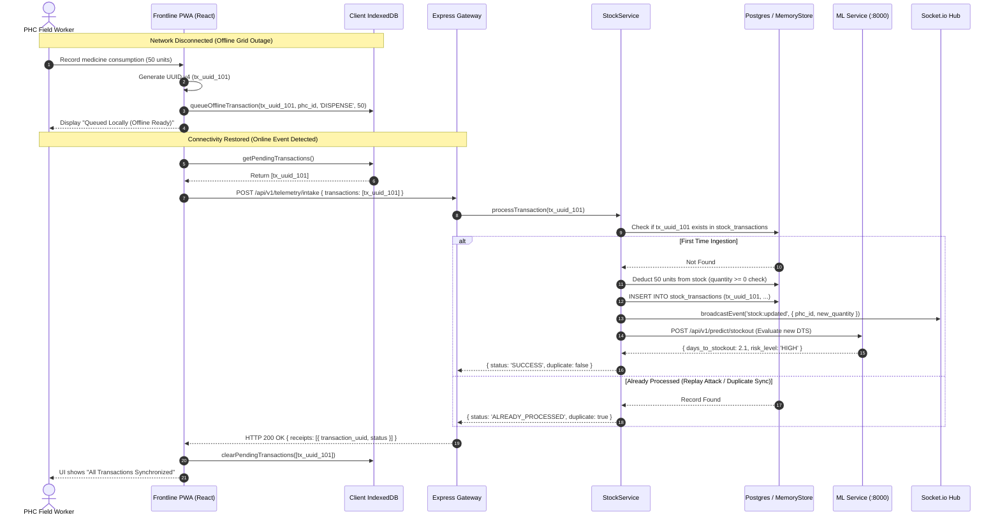

---

### 5.2 Real-Time Predictive Stockout & Alert Escalation Flow

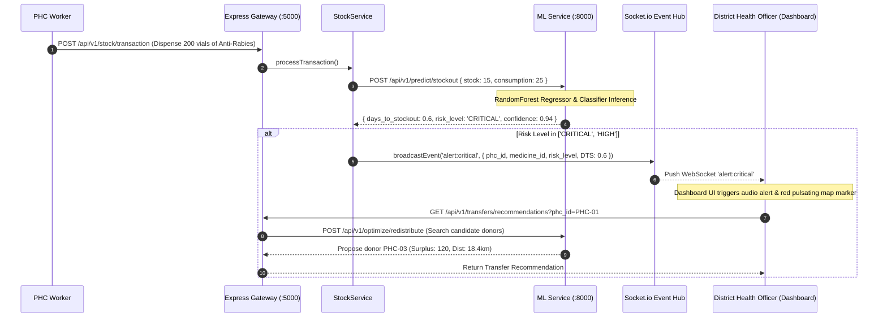

---

### 5.3 Cross-District Resource Rebalancing & Transfer Escrow Flow

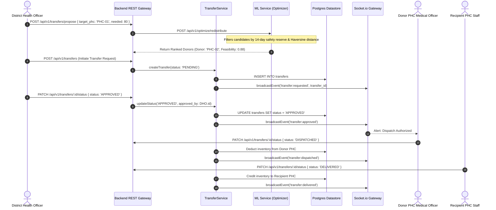

---

### 5.4 State-Level Privacy-Preserving Federated Learning Flow

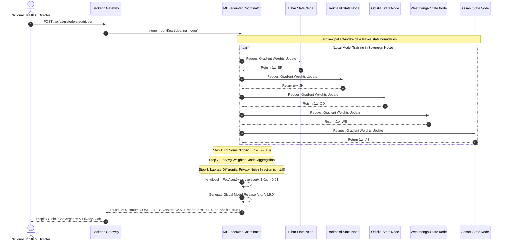

---

### 5.5 Bed Occupancy & Clinical Admitting State Diagram

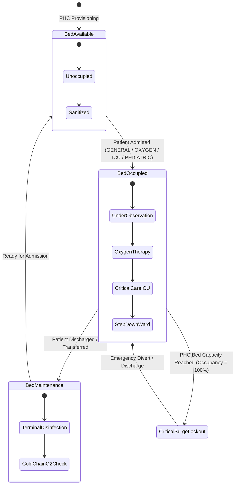

---

## 6. Security, Privacy & DPDP Act 2023 Compliance

### 6.1 Regulatory Guarantees & Privacy Matrix

| Regulatory Requirement | ArogyaGrid Technical Implementation | Architectural Guarantee |
|---|---|---|
| **Data Principal Consent & Anonymity** | No raw patient identifers (Aadhaar, ABHA card ID, phone numbers) are required for inventory and capacity operations. | **Zero PII Leakage**: The database only tracks aggregated numbers and inventory units. |
| **Cross-Border / Cross-State Restrictions** | Federated Averaging (`FedAvg`) executes in memory. State nodes retain their proprietary transaction telemetry. | **Sovereign Node Isolation**: Only weight gradients are shared across state nodes. |
| **Differential Privacy ($\epsilon$-DP)** | Laplace noise mechanism is applied to averaged model parameters before global broadcast. | **Mathematical Privacy Bound**: $P(\mathcal{M}(D) \in S) \le e^\epsilon \cdot P(\mathcal{M}(D') \in S)$ with $\epsilon = 1.0$. |
| **Integrity & Non-Repudiation** | UUID v4 idempotency tokens and signed JWT tokens with immutable timestamps. | **Replay Protection**: Transactions cannot be re-applied or manipulated. |

---

### 6.2 Role-Based Access Control (RBAC) Matrix

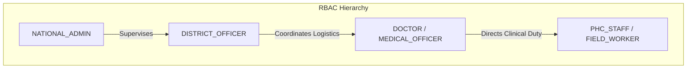

| Operational Capability | National Admin | District Officer | Medical Officer | PHC Staff |
|---|:---:|:---:|:---:|:---:|
| **Manage Formulary & Catalog** | ✅ | ❌ | ❌ | ❌ |
| **Trigger Federated AI Rounds** | ✅ | ❌ | ❌ | ❌ |
| **District GIS Command Console** | ✅ | ✅ | ❌ | ❌ |
| **Approve Cross-District Transfers** | ❌ | ✅ | ❌ | ❌ |
| **Bed Admitting & Discharge** | ❌ | ❌ | ✅ | ❌ |
| **Staff Shift Roster Management** | ❌ | ❌ | ✅ | ❌ |
| **Medicine Dispense & Intake** | ❌ | ❌ | ❌ | ✅ |
| **Vernacular Hindi Voice Kiosk** | ❌ | ❌ | ❌ | ✅ |
| **Offline Queue Batch Sync** | ❌ | ❌ | ✅ | ✅ |

---

## 7. Deployment Architecture & Infrastructure Topology

### 7.1 Containerized Docker Deployment

A single command (`docker compose up --build -d`) orchestrates the complete production-grade multi-container topology:

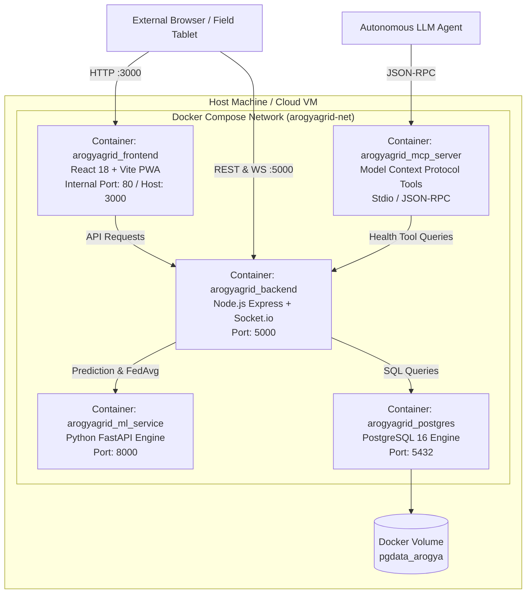

### 7.2 Port and Configuration Mapping

| Service Name | Container Name | Internal Port | Host Port | Environment Dependencies |
|---|---|---|---|---|
| **Frontend PWA** | `arogyagrid_frontend` | 80 / 3000 | `3000` | `VITE_API_BASE_URL=http://localhost:5000/api/v1` |
| **Backend REST & WS** | `arogyagrid_backend` | 5000 | `5000` | `PORT=5000`, `DATABASE_URL`, `JWT_SECRET`, `ML_SERVICE_URL=http://ml_service:8000` |
| **Python ML Engine** | `arogyagrid_ml_service` | 8000 | `8000` | `PORT=8000`, `DP_EPSILON=1.0`, `DP_CLIP_NORM=1.0` |
| **MCP Server** | `arogyagrid_mcp_server` | Stdio | Stdio | `BACKEND_URL=http://localhost:5000/api/v1` |
| **PostgreSQL DB** | `arogyagrid_postgres` | 5432 | `5432` | `POSTGRES_DB=arogyagrid`, `POSTGRES_USER`, `POSTGRES_PASSWORD` |

---

## 8. Reliability, Resilience & Disaster Recovery Strategies

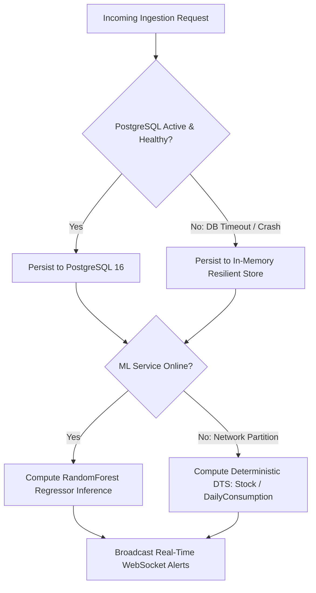

### 8.1 Network Partition Tolerance & CAP Theorem Trade-Offs
- ArogyaGrid opts for **AP (Availability and Partition Tolerance)** at the rural edge:
  - When disconnected from the internet, rural kiosks operate unimpeded.
  - Transactions are accepted and validated locally in client-side IndexedDB.
- When connected to the regional server, it switches to **CP (Consistency and Partition Tolerance)**:
  - Enforces atomic deduplication using UUID tokens and atomic SQL transactions.

### 8.2 Zero-Downtime Dual-Store Fallback
- `config/db.js` implements a transparent database proxy.
- If PostgreSQL fails to initialize or encounters a connection drop, queries automatically fall back to `memoryStore` without throwing 500 fatal errors.
- Telemetry logging and inventory tracking continue uninterrupted.

### 8.3 ML Microservice Degradation Strategy
- If the Python microservice is temporarily unavailable:
  - The Node.js backend calculates deterministic stockout metrics using classical burn-rate equations: $DTS = \frac{\text{Current Stock}}{\text{Daily Consumption}}$.
  - Critical alerts are still generated if $DTS < 3.0$ days.

---

## 9. Future Roadmap & Strategic Integrations

1. **National ABDM (Ayushman Bharat Digital Mission) Gateway**: Direct integration with the national Health Facility Registry (HFR) and Unified Health Interface (UHI).
2. **Cold-Chain IoT Sensor Ingestion**: Real-time MQTT telemetry streaming from vaccine storage refrigerators, automatically downgrading vaccine efficacy upon thermal excursion.
3. **Autonomous Medical Drone Logistics**: Automated triggering of medical delivery drones between CHCs and isolated rural PHCs for antivenom and emergency blood units.
4. **On-Device Edge ML via WebAssembly**: Compiling the stockout prediction model to ONNX Runtime Web for local zero-latency offline inference directly within the browser.

---

*Document maintained by the ArogyaGrid Core Architecture Team. Built for resilience across India's public healthcare grid.*
